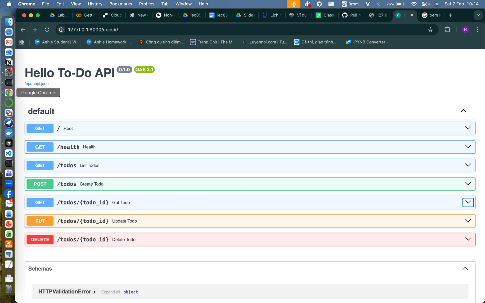
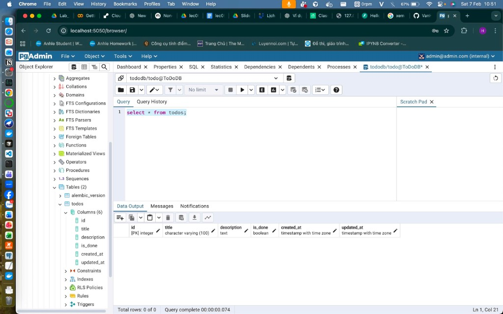
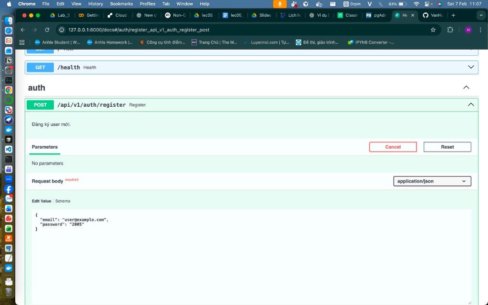
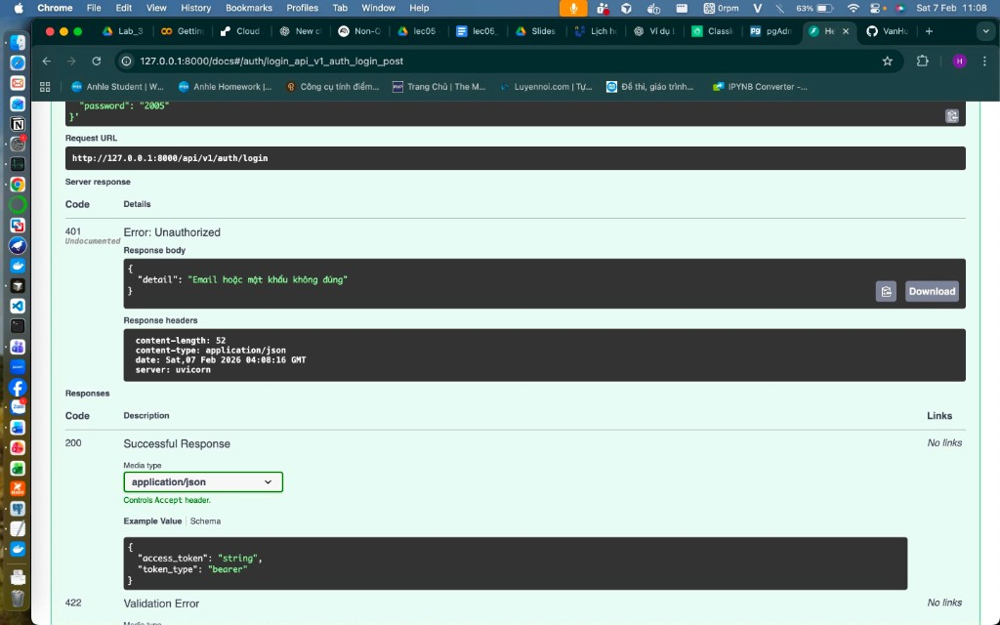
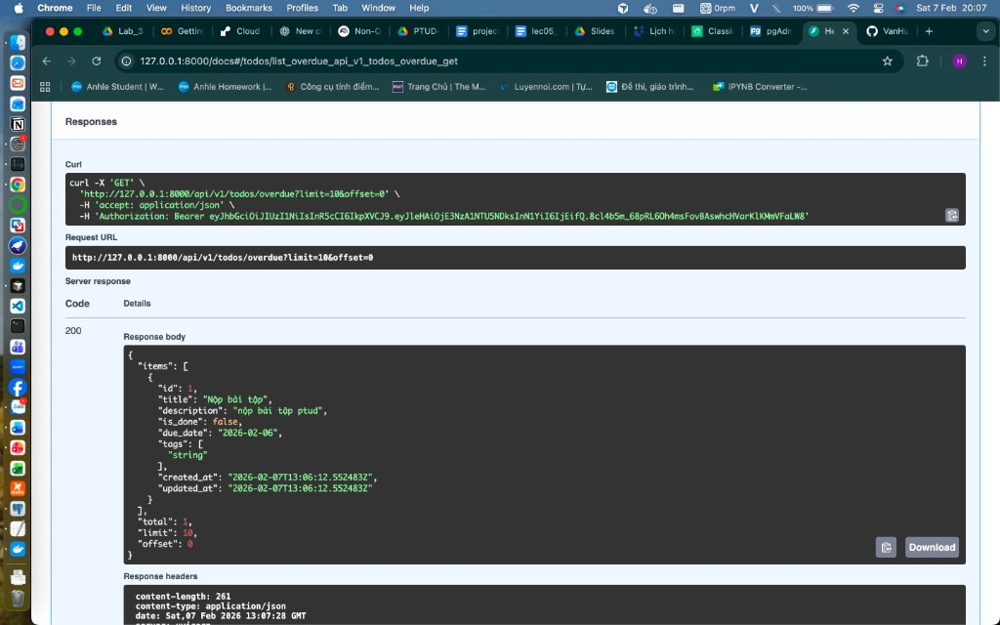
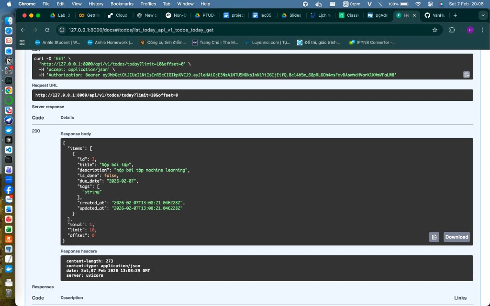

# Hello To-Do API (FastAPI)

## Cấp 0 — Làm quen FastAPI

Mục tiêu: tạo API tối thiểu chạy được.

### Yêu cầu

- Tạo project FastAPI
- **Endpoint:**
  - `GET /health` → trả `{ "status": "ok" }`
  - `GET /` → trả message chào

### Tiêu chí đạt

- Chạy uvicorn và gọi được 2 endpoint.


---

## Cấp 1 — CRUD cơ bản (dữ liệu trong RAM)

Mục tiêu: CRUD với list/dict trong bộ nhớ (chưa dùng DB).

### Model ToDo

- `id`: int
- `title`: str
- `is_done`: bool = False

### Endpoints

| Method | Path | Mô tả |
|--------|------|--------|
| POST | `/todos` | Tạo todo |
| GET | `/todos` | Lấy danh sách |
| GET | `/todos/{id}` | Lấy chi tiết |
| PUT | `/todos/{id}` | Cập nhật toàn bộ |
| DELETE | `/todos/{id}` | Xóa |

### Tiêu chí đạt

- Validate dữ liệu bằng Pydantic
- Trả lỗi 404 khi không tìm thấy

### Swagger UI (Cấp 1)

Mở [http://127.0.0.1:8000/docs](http://127.0.0.1:8000/docs) để xem và gọi thử API:



---

## Cấp 2 — Validation “xịn” + filter / sort / pagination

Mục tiêu: API giống thực tế hơn.

### Yêu cầu

- **Validation:** `title` không được rỗng, độ dài 3–100 ký tự.
- **GET /todos** hỗ trợ:
  - **filter:** `is_done=true` hoặc `is_done=false`
  - **search:** `q=keyword` (tìm theo title)
  - **sort:** `sort=created_at` (tăng dần) hoặc `sort=-created_at` (giảm dần)
  - **pagination:** `limit`, `offset`

### Model ToDo (cập nhật)

- `id`: int
- `title`: str
- `is_done`: bool = False
- `created_at`: datetime (tự gán khi tạo)

### Response GET /todos

Cấu trúc trả về:

```json
{
  "items": [...],
  "total": 123,
  "limit": 10,
  "offset": 0
}
```

### Ví dụ gọi GET /todos

- `/todos?is_done=false` — chỉ todo chưa xong
- `/todos?q=FastAPI` — tìm title chứa "FastAPI"
- `/todos?sort=-created_at&limit=5&offset=0` — mới nhất, 5 bản ghi đầu

### Tiêu chí đạt

- Response có cấu trúc `{ "items", "total", "limit", "offset" }`.

---

## Cấp 3 — Tách tầng (router / service / repository) + cấu hình chuẩn

Mục tiêu: viết như dự án thật.

### Yêu cầu

- **Tách thư mục:** `routers/`, `schemas/`, `services/`, `repositories/`, `core/`
- Dùng **APIRouter**, prefix **`/api/v1`**
- **Config** bằng pydantic-settings (env): `APP_NAME`, `DEBUG`, `API_V1_PREFIX`, …

### Cấu trúc thư mục (Cấp 3)

| Thư mục | Nội dung |
|--------|----------|
| `core/` | `config.py` (pydantic-settings), `deps.py` (dependency injection) |
| `schemas/` | Model Pydantic: ToDo, ToDoCreate, ToDoUpdate, TodoListResponse |
| `repositories/` | Truy cập dữ liệu (in-memory), không chứa logic filter/sort |
| `services/` | Nghiệp vụ: filter, sort, pagination, gọi repository |
| `routers/` | Định nghĩa endpoint, gọi service (không viết logic DB) |

### Endpoints sau khi tách

- `GET /`, `GET /health` — vẫn ở root
- `GET/POST /api/v1/todos`, `GET/PUT/DELETE /api/v1/todos/{id}` — API qua prefix `/api/v1`

### Config (`.env`)

Tạo file `.env` (tham khảo `.env.example`):

```
APP_NAME=Hello To-Do API
DEBUG=false
API_V1_PREFIX=/api/v1
```

### Tiêu chí đạt

- Không viết logic DB trong router
- Có file `main.py` sạch (chỉ tạo app và include router)

---

## Cấp 4 — Database (PostgreSQL) + ORM + Migration

Mục tiêu: lưu dữ liệu thật.

### Yêu cầu

- **SQLAlchemy** (ORM), bảng **todos**: `id`, `title`, `description`, `is_done`, `created_at`, `updated_at`
- **Alembic** để migration
- **PostgreSQL** chạy bằng **Docker Compose**, cổng **5433**
- **Endpoints thêm:**
  - `PATCH /api/v1/todos/{id}` — cập nhật một phần (vd: chỉ `is_done`)
  - `POST /api/v1/todos/{id}/complete` — đánh dấu hoàn thành

### Bảng todos (PostgreSQL)

| Cột | Kiểu | Ghi chú |
|-----|------|--------|
| id | integer | PK, auto |
| title | varchar(100) | not null |
| description | text | nullable |
| is_done | boolean | default false |
| created_at | timestamptz | server_default |
| updated_at | timestamptz | server_default, onupdate |

### Tiêu chí đạt

- `created_at` / `updated_at` tự cập nhật (DB)
- Pagination thực sự từ DB (limit/offset trong query)

### Kết nối pgAdmin 4

Dùng pgAdmin 4 (app trên máy hoặc Docker) kết nối tới PostgreSQL:

| Ô | Giá trị |
|---|--------|
| Host | `localhost` |
| Port | **5433** |
| Database | `tododb` |
| Username | `todo` |
| Password | `todo` |

Sau khi kết nối, mở **Databases** → **tododb** → **Schemas** → **public** → **Tables** → **todos**. Có thể chạy `SELECT * FROM todos;` trong Query Tool.



---

## Cấp 5 — Authentication + User riêng

Mục tiêu: mỗi user có to-do riêng.

### Yêu cầu

- **Bảng users:** `id`, `email`, `hashed_password`, `is_active`, `created_at`
- **JWT login:**
  - `POST /api/v1/auth/register` — đăng ký
  - `POST /api/v1/auth/login` — đăng nhập (trả JWT)
  - `GET /api/v1/auth/me` — thông tin user đăng nhập (cần Bearer token)
- **Todo gắn owner_id:** mọi todo thuộc một user; API todo yêu cầu đăng nhập.

### Bảng users (PostgreSQL)

| Cột | Kiểu | Ghi chú |
|-----|------|--------|
| id | integer | PK, auto |
| email | varchar(255) | unique, not null |
| hashed_password | varchar(255) | not null (bcrypt) |
| is_active | boolean | default true |
| created_at | timestamptz | server_default |

### Bảng todos (cập nhật)

Thêm cột **owner_id** (FK → users.id). Chỉ user sở hữu mới xem/sửa/xóa được todo đó.

### Tiêu chí đạt

- **User A không xem/xóa todo của User B** — filter theo `owner_id`, mọi endpoint todo dùng `get_current_user`.
- **Password hash bằng passlib/bcrypt** — không lưu plain password.

### Luồng sử dụng

1. **Đăng ký:** `POST /api/v1/auth/register` với `{"email": "user@example.com", "password": "matkhau123"}`.
2. **Đăng nhập:** `POST /api/v1/auth/login` với cùng email/password → nhận `access_token`.
3. **Gọi API todo:** thêm header `Authorization: Bearer <access_token>`.
4. **Trong Swagger:** bấm **Authorize**, nhập username = email và password (hoặc dùng `/auth/token` với form) → sau đó gọi các endpoint todo.

### Swagger UI — Auth (Cấp 5)

**Đăng ký user mới** — body: `email`, `password` (tối thiểu 6 ký tự):



**Đăng nhập** — sai email/mật khẩu trả 401 và message "Email hoặc mật khẩu không đúng"; đúng thì trả 200 với `access_token`:



---

## Cấp 6 — Nâng cao (tag, deadline, nhắc việc)

Mục tiêu: thêm tính năng giống app thật.

### Yêu cầu tính năng

- **due_date** (deadline) — ngày hạn, kiểu date, tùy chọn
- **tags** — nhiều tag (mảng chuỗi), tùy chọn
- **GET /api/v1/todos/overdue** — danh sách todo quá hạn (`due_date` &lt; hôm nay)
- **GET /api/v1/todos/today** — việc cần làm hôm nay (`due_date` = hôm nay)

### Bảng todos (cập nhật Cấp 6)

Thêm cột:

| Cột | Kiểu | Ghi chú |
|-----|------|--------|
| due_date | date | nullable |
| tags | text[] | nullable (PostgreSQL array) |

### Endpoints mới (cần Bearer token)

| Method | Path | Mô tả |
|--------|------|--------|
| GET | `/api/v1/todos/overdue` | Todo quá hạn (limit, offset) |
| GET | `/api/v1/todos/today` | Todo có deadline hôm nay (limit, offset) |

### Ví dụ response

**GET /api/v1/todos/overdue** và **GET /api/v1/todos/today** trả về cùng cấu trúc:


### Swagger UI — Overdue & Today (Cấp 6)

**Todo quá hạn** — `GET /api/v1/todos/overdue?limit=10&offset=0` (cần Authorization: Bearer token):



**Việc hôm nay** — `GET /api/v1/todos/today?limit=10&offset=0`:



---

## Cấp 7 — Testing + tài liệu

Mục tiêu: hoàn chỉnh quy trình (test, tài liệu).

### Yêu cầu

- Viết test bằng **pytest** + **TestClient** (FastAPI).
- Test các case: **tạo thành công**, **validation fail**, **404**, **auth fail**.

### Thư mục tests

Toàn bộ test nằm trong thư mục **`tests/`** ở root project:

```
tests/
├── __init__.py
├── conftest.py      # fixtures: client, auth_headers
├── test_auth.py     # register, login, auth fail
└── test_todos.py    # create success, validation fail, 404, auth fail
```

### Các case đã test

| Case | File | Mô tả |
|------|------|--------|
| Tạo thành công | test_todos | POST /todos với token → 200, có id, title |
| Validation fail | test_auth, test_todos | Register password ngắn, Todo title &lt; 3 ký tự → 422 |
| 404 | test_todos | GET /todos/999999 → 404 |
| Auth fail | test_auth, test_todos | GET /me hoặc GET/POST /todos không token → 401 |

### Chạy test

**Lưu ý:** PostgreSQL phải đang chạy và đã `alembic upgrade head`.

```bash
pip install -r requirements.txt
pytest
# hoặc xem chi tiết:
pytest -v
```

---

## Cấp 8 — Soft delete (deleted_at)

Todo không bị xóa vật lý; khi gọi **DELETE /api/v1/todos/{id}** hệ thống chỉ ghi thời điểm xóa vào cột **`deleted_at`**.

- **Migration:** `004_add_deleted_at_to_todos.py` — thêm cột `deleted_at` (TIMESTAMP WITH TIME ZONE, nullable) vào bảng `todos`.
- **Model:** `TodoModel.deleted_at` (nullable).
- **Logic:**
  - Mọi truy vấn đọc (danh sách, chi tiết, overdue, today) chỉ lấy bản ghi có `deleted_at IS NULL`.
  - Xóa todo: set `deleted_at = now()` rồi commit, không gọi `DELETE` trên DB.

Sau khi cập nhật code, chạy: `alembic upgrade head`.

---

## Cấu trúc project

```
FastAPI/
├── core/
│   ├── config.py
│   ├── database.py
│   ├── deps.py
│   └── security.py
├── models/
│   ├── base.py
│   ├── todo.py       # + deleted_at (Cấp 8 soft delete)
│   └── user.py
├── schemas/
│   ├── todo.py
│   └── user.py
├── repositories/
│   ├── todo_repository.py
│   └── user_repository.py
├── services/
│   ├── auth_service.py
│   └── todo_service.py
├── routers/
│   ├── root.py
│   ├── auth.py
│   └── todo.py
├── tests/           # Cấp 7 — pytest
│   ├── conftest.py
│   ├── test_auth.py
│   └── test_todos.py
├── alembic/versions/  # 001–003 + 004 deleted_at
├── main.py
├── pytest.ini
├── docker-compose.yml
├── requirements.txt  # + pytest
├── .env.example
├── docs/
└── README.md
```

## Cài đặt và chạy

1. **Cài dependencies:**

   ```bash
   pip install -r requirements.txt
   ```

2. **Chạy PostgreSQL (Docker, cổng 5433):**

   ```bash
   docker-compose up -d
   ```

3. **Chạy migration:**

   ```bash
   alembic upgrade head
   ```

4. **Chạy server:**

   ```bash
   uvicorn main:app --reload --host 127.0.0.1 --port 8000
   ```

5. **Chạy test (Cấp 7):** `pytest` hoặc `pytest -v` (cần Postgres + migration trước).

6. **Kiểm tra:**
   - Trang chủ: [http://127.0.0.1:8000/](http://127.0.0.1:8000/)
   - Health: [http://127.0.0.1:8000/health](http://127.0.0.1:8000/health)
   - Auth (Cấp 5): [http://127.0.0.1:8000/api/v1/auth/register](http://127.0.0.1:8000/api/v1/auth/register), [login](http://127.0.0.1:8000/api/v1/auth/login), [me](http://127.0.0.1:8000/api/v1/auth/me)
   - API Todo (cần Bearer token): [http://127.0.0.1:8000/api/v1/todos](http://127.0.0.1:8000/api/v1/todos), [overdue](http://127.0.0.1:8000/api/v1/todos/overdue), [today](http://127.0.0.1:8000/api/v1/todos/today)
   - Swagger UI: [http://127.0.0.1:8000/docs](http://127.0.0.1:8000/docs)
   - pgAdmin (Docker, nếu dùng): [http://127.0.0.1:5050](http://127.0.0.1:5050) — đăng nhập `admin@admin.com` / `admin`
