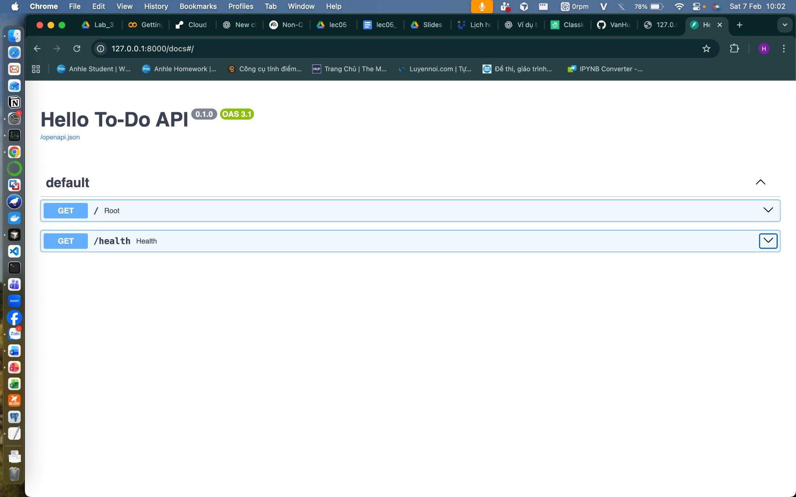

# Cấp 0 — Làm quen FastAPI (Hello To-Do)

Mục tiêu: tạo API tối thiểu chạy được.

## Yêu cầu

- Tạo project FastAPI
- **Endpoint:**
  - `GET /health` → trả `{ "status": "ok" }`
  - `GET /` → trả message chào

## Cấu trúc project

```
FastAPI/
├── main.py           # Ứng dụng FastAPI và các endpoint
├── requirements.txt  # Dependencies
├── docs/             # Ảnh minh họa
└── README.md
```

## Cài đặt và chạy

1. **Cài dependencies:**

   ```bash
   pip install -r requirements.txt
   ```

2. **Chạy server:**

   ```bash
   uvicorn main:app --reload --host 127.0.0.1 --port 8000
   ```

3. **Kiểm tra endpoint:**
   - Trang chủ: [http://127.0.0.1:8000/](http://127.0.0.1:8000/)
   - Health: [http://127.0.0.1:8000/health](http://127.0.0.1:8000/health)
   - Tài liệu API (Swagger UI): [http://127.0.0.1:8000/docs](http://127.0.0.1:8000/docs)

## Tiêu chí đạt

- Chạy uvicorn và gọi được 2 endpoint.

## Swagger UI (Docs)

Khi chạy xong, mở `/docs` để xem và gọi thử API:


